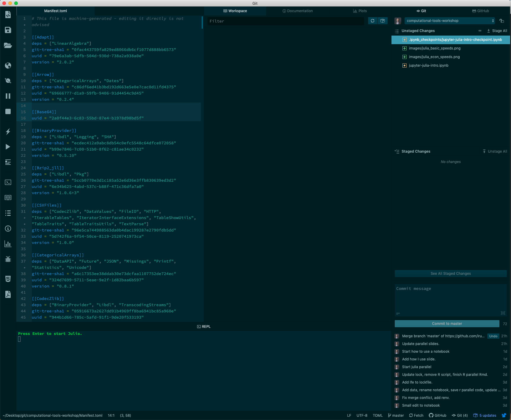

# Computational tools for social scientists
## A reproducible report with Jupyter and Julia
## Ivan Rudik

# Jupyter

What's a Jupyter notebook?

A web-based computational environment with a bunch of input/output cells that have code, markdown, plots, and other stuff

Jupyter is named after its three core languages: **Ju**lia, **Py**thon, **R**, but can also be used with Stata, MATLAB, and others

The notebook can be easily exported to html, pdf, latex, etc

### Interactive binder, link in the repo README

[](https://mybinder.org/v2/gh/binder-examples/demo-julia/master)


# Why use Jupyter notebooks?

## Integrated

The code, description, and output (visualizations, tables, etc) are in a single document

This promotes an iterative, on-the-fly workflow

# Why use Jupyter notebooks?

## Fast

Install through `conda`, `pip`, or a `docker` image (requires Python installed, but usually no Python knowledge necessary to run)

Once installed, you can spin up a notebook session really quick, in shell just type: ``jupyter notebook``

Easy to navigate and compile code

# Why use Jupyter notebooks?

## Portable

You run notebooks in a web browser and VSCode with or without an internet connection, send and use notebooks across OS's easily

# How to think about Jupyter

One way to think about it differences in integration

## Separate code/document/output
1. Write code
2. Execute code
3. Write document
4. Execute document

## Jupyter
1. Write code and/or document chunk
2. Execute code and/or document chunk
3. Repeat

# Ways to use Jupyter

## Slides

You can use Jupyter with RISE and reveal.js to make a relatively decent set of slides

Code is embedded so it's dynamic

Takes a little bit of html/css work to make it look good

Works similarly to RMarkdown slides

# Ways to use Jupyter

## Prelim analyses

You can start new code in Jupyter notebooks since they're quick to spin up and code interactively

Also make for a nice way to share results with co-authors since you can add text / description throughout in a clear way

(I use RMarkdown personally but Jupyter works just as well, especially if you don't use R)

# Ways to use Jupyter

## Document submissions

Jupyter is *relatively* customizable

You can use html/css to customize the style of the notebook

The general structure of the notebook will always be the same, not as flexible as LaTeX, MSWord, etc

Works pretty nicely if you are going through the data editor process with Lars, submitting problem sets requiring coding and writing, etc

# How to use a notebook

Finally, how do we navigate and use a notebook?


```julia
# Load up Julia environment
using Pkg
Pkg.activate(".")
Pkg.instantiate()

```

      Activating environment at `~/Desktop/git/computational-tools-workshop/Project.toml`


```julia
using Plots
x = collect(range(.1, stop = .2, length = 10)) # generate evenly spaced grid
mc = ones(size(x)).*2                          # generate equal length vector of mc=2

# Demand function
demand(p) = p.^(-0.2)/2 .+ p.^(-0.5)/2
```


    demand (generic function with 1 method)


```julia
# Get corresponding quantity values at these prices
y = demand(x)
plot(x, [y mc],
    linestyle = [:solid :dot],
    linewidth = [3 3],
    linecolor = [:red :blue],
    tickfontsize = 12,
    grid = :no,
    xlabel = "Quantity",
    ylabel = "Price",
    label = ["p(q)" "Marginal Cost"])
```


    

    


```julia
# This is a code cell
# Press cmd+enter to run, shift+enter to run and move to the next cell
foobar = 5+5

println("5+5 = $foobar.")
```

    5+5 = 10.


```julia
# Cells can reference variables defined in previous cells

println("Again, 5+5 = $foobar.")
```

    Again, 5+5 = 10.


```julia
#You can have slightly more complicated expressions and computations
using Random
Random.seed!(1234321)

A = rand(5, 5) # Random 5x5 array
b = rand(5) # Random 5 element vector
x = A\b # Solve the linear system
```


    5-element Vector{Float64}:
      0.7841295946313819
      0.7513739864773739
      0.8035199588959565
     -1.6359617126881012
      0.5610554369390122


# Reproducibility in Julia

Julia makes reproducibility and versioning very easy with the package manager `Pkg`

All you need to do is activate your project `Pkg.activate("directory_here")` and it generates `.toml` files that give the unique GitHub SHA hashes for the package versions and all dependencies

```
[deps]
LinearAlgebra = "37e2e46d-f89d-539d-b4ee-838fcccc9c8e"
Plots = "91a5bcdd-55d7-5caf-9e0b-520d859cae80"
Random = "9a3f8284-a2c9-5f02-9a11-845980a1fd5c"

[compat]
julia = "1.6.2"
```

These are the packages, versions, and julia version used in this notebook

# Reproducibility in Julia

Others can instantiate your project quickly with `Pkg.instantiate()` as in the top code cell

Atom/VSCode integrate with GitHub making version control very easy as well

VSCode also integrates well with Jupyter (wrote this notebook using VSCode!)


