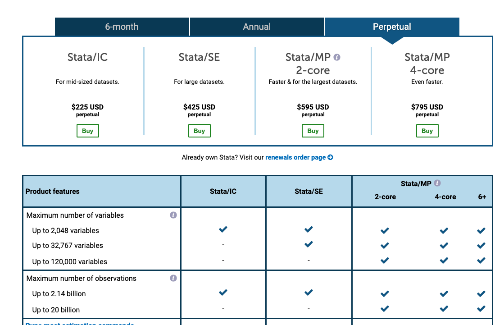
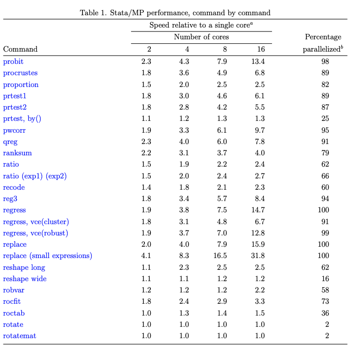

exclude: true
```{r setup}
if (!require("pacman")) install.packages("pacman")
pacman::p_load(
  tidyverse, xaringanExtra, Ryacas, rlang
)
options(htmltools.dir.version = FALSE)
knitr::opts_hooks$set(fig.callout = function(options) {
  if (options$fig.callout) {
    options$echo <- FALSE
  }
knitr::opts_chunk$set(echo = TRUE, fig.align="center")
  options
})
```
```{r xaringanExtra, echo = FALSE}
xaringanExtra::use_xaringan_extra(c("tile_view", "panelset", "webcam"))

```
```{r echo=FALSE}
xaringanExtra::style_panelset(panel_tab_color_active = "red")
```

```{css, echo=FALSE}
/* custom.css */
.left-code {
  color: #777;
  width: 38%;
  height: 92%;
  float: left;
}
.right-plot {
  width: 60%;
  float: right;
  padding-left: 1%;
}
.plot-callout {
  height: 225px;
  width: 450px;
  bottom: 5%;
  right: 5%;
  position: absolute;
  padding: 0px;
  z-index: 100;
}
.plot-callout img {
  width: 100%;
  border: 4px solid #23373B;
}
```

---

# Why does parallelization matter?

Procedures in economics often require the execution of many independent jobs:

--

.hi-blue[Bootstrap:] estimate model on independent re-samples of the data

--

.hi-blue[Fixed effects estimation:] method underlying `reghdfe`, `lfe::felm` (method of alternating projections) has components that can be done in parallel

--

.hi-blue[Value function iteration:] set of independent Bellman-maximization problems on a state space grid

--

.hi-blue[Raster operations:] if you need to perform transformations, reprojections, etc

--

.hi-blue[Any data processing over multiple years, states:] These are probably independent, can be written as a function

---

# Why does parallelization matter?

These tasks can be significantly sped up by executing them in parallel

--

Doing things in parallel is different across languages, platforms

--

Here we will see how to do parallel computing in Stata, R, and Julia
  - everything on a 2 core laptop

---

# Stata

How do we parallelize in Stata?

Step 1: Buy StataMP
Step 2: Run StataMP

--

.pull-left[


]

.pull-right[



]

---

# Stata

Parallelization in Stata is *relatively* straightforward because you don't have to do anything

--

Many common functions are parallelized (e.g. reshape, replace, destring, sort)

--

Keep in mind you wont often get N times speed up with N cores

--

Stata also doesn't auto-parallelize some obvious ones like bootstrapping

--

You can get around this by parallelizing batch calls to Stata using `parallel` at [https://github.com/gvegayon/parallel](https://github.com/gvegayon/parallel)

--

Or just do it in serial, you don't need to parallelize everything

---

# R

You don't need to pay to parallelize in R (nice)

--

There's a lot of different ways to do it though

--

I'll just be going over two ways that use the `future` and `furrr` packages:
   - Loops
   - Apply/map

I'd generally recommend the `apply` and `map` family of functions over loops for parallelizing, it forces you to code in terms of functions and makes your code cleaner

--

Use loops when future iterations depend on previous iterations

---

# R

Required packages for the R code: `tidyverse, broom, tictoc, lfe, fixest, furrr, doFuture`

--

The GitHub repo `irudik/computational-tools-workshop` has everything ready to go with matching package versions using the `renv` package

--

What we will be doing in parallel is .hi-red[bootstrapping standard errors]

--

Main idea in case you forgot:

1. Resample dataset N times with replacement
2. Estimate the model on the N resampled datasets
3. Standard deviation of your estimate of interest across the N datasets is your estimated standard error

---

# R Step 1: Load packages

First you've gotta load your packages

```{r}
# Load packages via pacman package manager
if (!require("pacman")) install.packages("pacman")
pacman::p_load(
  tidyverse, tictoc, doFuture,
  fixest, broom, furrr, renv
)
```

You can alternatively use the usual `library` loaders but `pacman` is nice and auto-installs new packages

---

# R Step 2: Initialize parallel processing infrastructure

Next, you need to let your compute know you're going to do parallel processing

```{r}
registerDoFuture()
plan(multiprocess)
```

`registerDoFuture()` spins up the parallel computing infrastructure


`plan(multiprocess)` lets the computer know your plan for doing computing (serially, multicore, multithreaded, etc)

---

# R Step 3: Initialize RNG seed

For reproducibility, we need to set a seed for our random number generator

```{r}
set.seed(1234321)
```

This makes sure that we get the same result each time we (or someone else) run our code even though the re-sampling is done "randomly"

---

# R Step 4: Load in data

Read in the csv, this is just a dataset on biodiversity and economic development

```{r, message = F}
df <- read_csv("data/final_panel.csv")
df
```

---

# R Step 5: Define parameters

Next we need to decide how many bootstrap samples we want, and we need to initialize a list for the execution times, and a data.frame for the output

```{r}
# Number of bootstrap resamples
N <- 200

# initialize list of times
times <- list()

# initialize storage df
bootstrap_samples <- tibble()
```

---

# R Step 6: Define function

Next we need to define our bootstrap function for estimation

```{r}
bootstrap_ses <- function(N) {
  df %>%
    dplyr::sample_frac(replace = TRUE) %>%
    fixest::feols(I(log(abundance)) ~ I(log(gdppc)) + temp_avg + precip_avg + interact(year, state) |
                    location_id + year, data = .) %>%
    broom::tidy() %>%
    dplyr::filter(stringr::str_detect(term, "gdppc")) %>%
    dplyr::select(estimate)
}
```

This function:

1. resamples the dataset with replacement
2. estimates a fixed effect model with `fixest::feols`
3. recovers the coefficient on `log(gdppc)`


---

# R Step 7: Execute the function

First lets run it sequentially to get a sense of the baseline:

```{r}
tic()
serial_feols <- replicate(N, bootstrap_ses(N)) %>%
  unlist() %>%
  as_tibble() %>%
  mutate(type = "serial")
time <- toc()
times[["serial_feols"]] <- time$toc - time$tic
```

---

# R Step 7: Execute the function

Next, lets run it in parallel using a parallel for loop

```{r}
tic()
dopar_feols <- foreach(n = seq(N)) %dopar% {
  bootstrap_ses(n)
} %>%
  unlist() %>%
  as_tibble() %>%
  mutate(type = "dopar")
time <- toc()
times[["dopar_feols"]] <- time$toc - time$tic
```

---

# R Step 7: Execute the function

Next, lets run it in parallel using `furrr::future_map_dfr`

```{r}
tic()
furrr_feols <- future_map_dfr(
  seq(N),
  bootstrap_ses,
  .options = future_options(globals = "df")
  ) %>%
  unlist() %>%
  as_tibble() %>%
  mutate(type = "furrr")
time <- toc()
times[["furrr_feols"]] <- time$toc - time$tic
```

---

# Now lets check the output

Now lets look at what we got:

```{r}
times
```

Parallelization across 2 cores gets almost exactly 2x speed up

---

# Now lets check the output

Estimation is relatively expensive so the fixed costs of parallelizing aren't that big relative to the speed gains

`furrr` is generally slightly faster than `dopar` in addition to being better coding

--

Clone the github repo and use `parallelization_server.R` on the BioHPC servers to see if $#$ cores speed-up holds more generally

---

# Now lets check the output

```{r}
bind_rows(serial_feols, dopar_feols, furrr_feols) %>%
  group_by(type) %>%
  summarise(sd(value))
```

We get similar standard error estimates

---

# Julia

You also don't need to pay to parallelize in R (nice)

--

There's two main ways to parallelize in Julia, both have pros and cons:
  - `pmap`
  - `@distributed`

--

Rule of thumb: use `pmap` with big jobs, use `@distributed` with smaller jobs

---

# Julia: pmap vs distributed

`pmap` is a parallel map

`@distributed` makes a parallel for loop like `%dopar%` in R

--

What's the difference?

--

`@distributed` takes a quick and dirty approach: it just assigns the same number of jobs to each worker

--

This can cause inefficiencies if you have jobs with different execution times, leaving you hanging with one worker with several jobs left to do when they could be spread out over many workers

--

The benefit is it's quick: just send the jobs to the workers and wait

---

# Julia: pmap vs distributed

`pmap` does .hi-blue[load balancing / dynamic scheduling:] it assigns jobs to workers as they complete jobs

--

This makes sure workers are always busy and not idle

--

But there's a fixed cost communication overhead with load balancing: if you have small easy jobs that are similar size, this will dominate the gains from load balancing

---

# Julia

Required packages for the Julia code: `Pkg, Distributed, Random, DataFrames, CSVFiles, FixedEffectModels, SharedArrays, Statistics`

--

The GitHub repo `irudik/computational-tools-workshop` has everything ready to go with matching package versions using the `renv` package

--

Again, we will be .hi-red[bootstrapping standard errors] in parallel


---

# Julia Step 1: Load packages

First you've gotta load your packages onto each worker

```{julia}
using Pkg
Pkg.activate(".")
Pkg.instantiate()
using Distributed, Random
```

Julia has very nice built-in package manager, making it easy to generate reproducible code


---

# Julia Step 2: Instantiate parallel processing infrastructure
```{julia}
# add 1 worker
addprocs(1)

@everywhere using Pkg
@everywhere Pkg.activate(".")
@everywhere Pkg.instantiate()
@everywhere using Queryverse, FixedEffectModels, SharedArrays
```

A quirk of Julia is you need to start off loading the packages onto each worker using `@everywhere`

---

# Julia Step 3: Initialize RNG seed

```{julia}
Random.seed!(1234321)
```

This makes sure our results are reproducible

---

# Julia Step 4: Load data

```{julia}
df = DataFrame(load("data/final_panel.csv"))
```

`Queryverse` is the Julia-equivalent of tidyverse for R

---

# Julia Step 5: Define parameters

```{julia}
N = 200
estimates_serial = Vector{Float64}(undef, N)
estimates_distrib = SharedArray{Float64}(N)
```

We need to initialize `Array`s for the serial and `@distributed` results, not for `pmap`

---

# Julia Step 6: Define function

Now we define our bootstrap function

```{julia}
@everywhere function bootstrap_ses(df)
    bootstrap_df = df[sample(axes(df, 1), nrow(df); replace = true), :]
    reg_output = reg(bootstrap_df,
        @formula(log(abundance) ~ log(gdppc) + temp_avg + precip_avg + fe(state)&year + fe(location_id) + fe(year)))

    return reg_output.coef[1]
end
```

The `@everywhere` macro makes sure its defined on all workers

---

# Julia Step 7: Execute function (pre-compile)

In Julia you often get massive speed gains by executing your function once before doing your main work

--

This is because it pre-compiles the function

```{julia, echo = FALSE, results = "hide"}

# serial
@time for i in 1:N
  estimates_serial[i] = bootstrap_ses(df)
end

# parallel map
@time estimates_pmap = pmap(bootstrap_ses, [df for i in 1:N])

# distributed
@time @sync @distributed for i in 1:N
  estimates_distrib[i] = bootstrap_ses(df)
end
```

---

# Julia Step 7: Execute function

First lets run it sequentially

```{julia}
@time for i in 1:N
  estimates_serial[i] = bootstrap_ses(df)
end
```


---

# Julia Step 7: Execute function

First lets use `pmap` to do load-balancing

```{julia}
@time estimates_pmap = pmap(bootstrap_ses, [df for i in 1:N])
```


---

# Julia Step 7: Execute function

Last lets use `@distributed` to do it quick and dirty

```{julia}
@time @sync @distributed for i in 1:N
  estimates_distrib[i] = bootstrap_ses(df)
end
```


---

# Now lets check the output

```{julia}
results = DataFrame(serial = estimates_serial, pmap = estimates_pmap, distrib = estimates_distrib);
describe(results, :standard_deviation => std)
```

--

Clone the github repo and use `parallelization_server.jl` on the BioHPC servers to see if $#$ cores speed-up holds more generally